# flutter-workflow-orchestrator

## npx 安装

如果你希望在任意项目目录里直接安装本仓库的 skills，执行：

```powershell
npx --yes --package file:D:\Git\flutter-skills flutter-skills install
```

这个命令会把当前包里的全部 `skills/` 安装到“当前执行目录”的 `.agents/skills/`。

如果你想指定安装目标根目录，执行：

```powershell
npx --yes --package file:D:\Git\flutter-skills flutter-skills install --target D:\Your\Project
```

## Codex 插件安装

如果你希望把本仓库作为可复用的 Codex plugin 安装，而不是手工复制 `skills/`，执行：

```powershell
powershell -NoProfile -ExecutionPolicy Bypass -File .\scripts\install-codex-plugin.ps1
```

这个命令会做两件事：

1. 把仓库根目录 `skills/` 同步到插件目录 `plugins/flutter-skills/skills/`
2. 用仓库内 `.agents/plugins/marketplace.json` 把 `flutter-skills` 安装到当前 Codex 环境

如果你只想刷新插件目录内容，不调用 `codex plugin add`，执行：

```powershell
powershell -NoProfile -ExecutionPolicy Bypass -File .\scripts\install-codex-plugin.ps1 -SkipCodexInstall
```

`flutter-workflow-orchestrator` 是 Flutter 技能链的总编排器。它负责维护唯一 workflow state，锁定当前阶段、下一个 skill、允许的状态变更，并阻止任何绕过门禁的推进。必要时可以把这些状态落成运行时产物，但它们不属于 skill 的稳定资源。

## 当前主流程

```mermaid
flowchart LR
    A["requirements_brainstorming"] --> B["prd_ready"]
    B --> C["technical_baseline_ready"]
    C --> D["shared_taste_direction"]
    D -.方向探索分支.-> X1["creative_direction_explore"]
    X1 --> X2["creative_direction_review"]
    X2 --> E["product_direction_confirmed"]
    D --> E["product_direction_confirmed"]
    E --> E1["design_md_ready"]
    E1 -.资产生产分支.-> X3["creative_asset_explore"]
    X3 --> Y["creative_asset_build"]
    Y --> Z["creative_asset_polish"]
    E1 --> F["global_effect_image_pilot_ready"]
    F --> G["global_effect_images_ready"]
    G --> H["stitch_design_source_ready"]
    H --> I["shared_freeze_gate"]
    I --> O["project_initialized"]
    O --> P["bootstrap_code_ready"]
    I --> K["module_impl_docs_ready"]
    K --> L["module_design_frozen"]
    L --> M["impl_rd_ready"]
    M --> N["architecture_ready"]
    N --> Q["implementing"]
    P --> Q["implementing"]
    Q --> R["module_done"]
```



## 关键收敛

1. Stitch 是唯一默认设计源。效果图只是视觉基线，不再把效果图本身当结构化设计源。
2. 全局视觉设计必须先头脑风暴，再确认最终方向，然后才允许出效果图。
3. 出效果图之前必须先同意并冻结统一公共壳，至少包括 `app-shell` / `root-shell`、导航宿主、顶层 tabs/header/footer 和 shell 级 overlay 语言。
4. 效果图采用代表页优先：先出 1 张代表页，等你确认后再生成其余页面。
5. 效果图统一存放在全局目录 `docs/project/`，不再要求落到模块目录。
6. `project_initialized` 只表示创建目录骨架以及与 `flutter-init` 同级的 `skills/flutter-dev/`，不包含 bootstrap 代码。
7. `bootstrap_code_ready` 单独成阶段，负责 app 入口、app shell、共享启动 wiring、根路由宿主等全局公共代码。
8. `implementing` 阶段必须先通过 `@superpowers` 的 `Spec`，再通过 `Plan`，之后默认按活动模块串行实现。
9. `parity_reviewed` 已移除，代码完成后的视觉对齐改为人工检查。
10. `workflow record` 和 `superpowers execution trace` 属于运行期过程产物，不再作为 skill 的稳定文件长期维护。
11. `Creative Production` 现在拆成两段：前置方向探索分支用于给产品方向确认提供视觉输入，后置资产分支用于创意生产和发布级润色，但都不替代 `@product-design`、`DESIGN.md`、Stitch/Pencil 结构化设计源或 Flutter 实现门禁。
12. `flutter-taste-router` 保留，但职责收敛为共享冻结和模块冻结前的设计包标准化、文本收口和高保真约束归一，不再主导全局方向探索。
13. `project_initialized` 和 `bootstrap_code_ready` 前移到共享冻结之后，作为主实现前的公共工程准备，而不是拖到所有模块后置再做。

## 阶段说明

### `requirements_brainstorming`

输入还是原始需求、半成品 brief 或一句话想法。这里先做需求头脑风暴、问题台账、阻塞问题消解，之后才允许生成 PRD。

当前已强化为 3 个固定动作：

1. 按统一 PRD 模板落产物
2. 跑 PRD 完整度 Gate
3. 检查 PRD 到技术基线、产品设计、Creative Production、模块拆分的映射是否成立

### `prd_ready`

PRD 已存在且通过完整度门禁，但还不能直接进设计或代码。下一步先用 `flutter-prd-rd-writer` 产出全局技术基线。

### `technical_baseline_ready`

全局技术基线已确定，包括包栈、后端协作、交付边界、存储/网络基线等。下一步进入全局视觉设计头脑风暴。

### `shared_taste_direction`

这里是全局视觉设计头脑风暴阶段。要产出产品气质、信息密度、层级、排版、色彩、组件家族、CTA 姿态、反模板化规则，以及验证平台基线。

这个阶段默认从 `https://mobbin.com/` 寻找产品设计灵感，只把它当成全局方向参考库，不把它当成正式设计源，也不替代后续共享 HTML 交互原型、冻结包和实现链路。

这个阶段里，如果需要更多商业化视觉输入，可以先走一段前置 `Creative Production` 方向探索分支，例如：

1. `Creative Production:explore`
2. `moodboard-explorer` / `ads-explorer` / `offer-explorer` / `scene-explorer`
3. 回到产品方向确认

这个阶段默认仍由 `@product-design` 负责全局产品方向推荐；`flutter-taste-router` 不再主导这里的方向探索，而是在方向确认后把已批准的方向、视觉证据和冻结约束收敛成 Flutter 可消费的 design packet。

在进入全局设计冻结前，这里应先基于 `Mobbin` 灵感整理 3 个可对比的产品设计方向，并明确其中 1 个主推荐。手动模式下在这里等待你确认最终采用哪一个；`--auto` 模式下则直接采用主推荐方向继续推进。

这个阶段结束后，还不能直接进入实现，必须先：

1. 同意统一公共壳
2. 再确认最终产品设计方向

### `product_direction_confirmed`

你已经基于 PRD、技术基线和全局视觉设计头脑风暴结果，明确确认最终产品设计方向。此后才允许进入效果图生成。

### `design_md_ready`

最终产品设计方向已经沉淀进根目录 `DESIGN.md`。从这里开始，如果需求是广告、活动、品牌、落地页 hero、社媒素材或发布物料，可以进入后置 `Creative Production` 资产分支：

1. `Creative Production:explore` 做路径分流
2. 按需进入 `moodboard-explorer` / `ads-explorer` / `offer-explorer` / `scene-explorer` / `shot-explorer` / `logo-explorer`
3. 方向确定后再进入 `Creative Production:generative-polish`

这个分支只负责“创意 -> 生产 -> 润色”，不负责替代产品页面设计源。

### `global_effect_image_pilot_ready`

已生成 1 张代表页浅色效果图，正在等待你确认或提出调整。手动模式会在这里等待确认；`--auto --preview` 可以继续自动推进。

### `global_effect_images_ready`

代表页已确认，且所有范围内页面的浅色效果图都已生成并批准。只有到这里，才允许进入 Stitch 结构化设计源阶段。

### `stitch_design_source_ready`

所有批准后的页面效果图已经进入 Stitch，并生成或校验了结构化设计源包。这里必须先冻结 `stitch_project_mode` 和 `stitch_project_id`。

进入 Stitch 前先问你二选一：

1. 新建 Stitch 项目
2. 使用已有 Stitch 项目

如果没有明确模式，流程必须中断。页面级 Stitch 设计在子代理中执行，最多 6 个页面并行。

### `global_guidelines_frozen`

这是共享冻结的内部第一步，用来把 `DESIGN.md`、结构化设计源和批准视觉证据收敛成可冻结的共享设计包。对外可以把它和下一步一起理解成一个“共享冻结门”。

### `design_freeze_ready`

这是共享冻结的内部第二步。通过这里以后，就认为共享设计冻结已经完成，后面可以并行启动两类准备：

1. `flutter-init` -> `bootstrap_code_ready`
2. `module_impl_docs_ready` -> 模块冻结与架构准备

### `module_impl_docs_ready`

模块拆分和模块细化已经合并成一步，直接产出可执行级别的 `impl.md`。这一步现在放在共享冻结之后、实现之前，与工程初始化准备并行推进。

### `module_design_frozen`

当前模块的 `impl.md`、Stitch 设计源包、高保真显示层约束、状态矩阵、视觉证据都已冻结。

这里新增一条前提：

1. 模块设计必须已经明确考虑真实使用平台
2. 模块设计必须以前提性高保真和高级感为目标，而不是留到实现阶段再补

### `impl_rd_ready`

模块实现文档已经可直接消费，且明确引用冻结后的 Stitch 设计源和共享基线。

### `architecture_ready`

冻结设计已经被翻译成 Flutter 可实现的 token、组件边界、屏幕结构、位图/原生绘制决策、显示层决策表。它不再承担“触发项目初始化”的职责，而是作为进入模块实现前的最后技术准备。

### `project_initialized`

这里只做目录初始化：

1. `flutter create` 干净工程
2. 去掉 demo
3. 创建目录骨架
4. 生成与 `flutter-init` 同级的 `skills/flutter-dev/`

这里允许的产物只有：

1. 目录
2. 最小依赖与插件基线
3. 非运行时占位文件或契约占位
4. 同级 `flutter-dev` 约束

这里不允许偷跑：

1. bootstrap 代码
2. app shell
3. router host / redirect
4. shared wiring
5. 页面代码
6. 业务实现

### `bootstrap_code_ready`

这是全局骨架代码阶段。这里才落：

1. app 入口
2. root app shell
3. router host / redirect policy
4. 全局 DI 或 provider scope 入口
5. storage / logging / error mapping 等共享启动 wiring
6. 模块实现会依赖的公共代码基线

### `implementing`

实现入口固定为：

1. `@superpowers` 产出 `Spec`
2. `@superpowers` 产出 `Plan`
3. 按 `Plan` 以串行为主执行当前活动模块，默认不同时打开多个模块实现通道

显示层实现前，如果存在对应页面效果图，必须先通过 `$image-to-code` 检查页面图。Stitch 还原时允许下载的图片资产可以直接使用，不强制再生。

### `module_done`

模块代码已落地，且人工视觉检查已经通过。

## `--auto` 会推进到哪里

`--auto` 会一直推进到工作流完成或遇到 blocker，不会停在普通下游确认点。

它会自动做这些事：

1. 从需求/PRD推进到技术基线
2. 推进到全局视觉设计头脑风暴
3. 在你尚未确认最终设计方向时停下
4. 你确认后，如果启用了 `--preview`，自动生成代表页效果图
5. 如果启用了 `--preview`，继续自动生成剩余页面效果图而不在普通确认点停下
7. 继续推进 Stitch、共享冻结，并在共享冻结后尽早推进项目初始化、bootstrap code、模块 `impl.md`、模块冻结和架构准备
8. 进入 `@superpowers` 的 `Spec` -> `Plan` -> 模块串行实现
9. 当所有目标模块都完成实现并进入人工复核交接时停止

`--auto` 不会做这些事：

1. 不会跳过全局视觉设计头脑风暴
2. 不会跳过“最终产品设计方向确认”
3. 不会在缺少必须确认时伪造人工确认
4. 不会越过 blocker
5. 不会越过缺失证据强行推进
6. 不会在缺少 `Spec` / `Plan` 时直接开始代码实现

## 设计源与高保真还原

### 为什么不再直接用效果图做设计源

只用效果图不稳定，原因有三个：

1. 效果图缺结构语义，难以稳定映射到组件层级、状态矩阵、滚动语义和 overlay 规则。
2. 多页面风格一致性容易靠主观猜测补齐，代码阶段会逐页漂移。
3. 高保真还原时，复杂区域如果只靠一张图，最后往往只能“像”，不能“准”。

### 为什么改成 Stitch 为唯一设计源

更优，前提是流程门禁严格：

1. 先确认全局视觉方向
2. 先确认代表页
3. 再补全所有页面效果图
4. 再把整套页面送进 Stitch
5. 冻结 `stitch_project_id`
6. 用 Stitch 结构化产物驱动冻结、架构和实现

这样效果图负责“视觉基线”，Stitch 负责“结构化实现源”，职责更清楚。

### 如何保证所有页面统一风格

统一风格依赖三层约束一起成立：

1. `shared_taste_direction`：先冻结全局视觉原则
2. `global_effect_images_ready`：所有页面共享同一批批准后的效果图基线
3. `stitch_design_source_ready`：所有页面进入同一个冻结的 Stitch 项目和设计源包

如果缺任意一层，后续代码还原都会漂。

### 高保真显示层最重要，流程里怎么保证

保证方式是硬门禁，而不是“开发时注意一下”：

1. 模块冻结前先检查高保真视觉契约
2. `flutter-uiux-to-architecture` 必须产出 region 级决策
3. 显示层实现前跑 display preflight
4. 对应页面图存在时，先走 `$image-to-code`
5. 代码完成后交给人工视觉检查

## Stitch 规则

1. Stitch 是唯一默认结构化设计源
2. 进入 Stitch 前必须先确认是新建项目还是已有项目
3. `stitch_project_id` 一旦冻结，后续不能随便改
4. 进入 Stitch 之前，必须先冻结一份全局设计母版 packet，所有页面都基于这份 packet 展开
5. Stitch 页面设计在子代理中执行，最多 6 个页面并行
6. 页面子代理只允许展开页面，不允许私自重定义全局风格、CTA 模型、导航壳层或核心组件家族
7. 还原 Stitch 设计稿时，允许下载批准后的图片并直接作为项目资产使用
8. merge 阶段必须检查全局统一性：token、排版层级、组件家族、shell、CTA、密度、图片处理姿态必须一致
9. 不再在仓库文档中记录任何 Stitch MCP 配置或 API key

## 平台记录规则

`platform_baseline` 和真实验证平台必须分开记录。

默认规则是：

- 只要用户没有显式批准别的基线，移动端设计规范就必须严格遵循 `iOS HIG`
- 这里的“严格遵循”至少覆盖 safe area、触控热区、导航、反馈、可读性、破坏性操作和可访问性
- 不能把它弱化成“接近 Apple 风格”或“参考 HIG”

例如：

- `ios_hig` 是行为/设计基线
- `android_emulator`
- `windows_desktop`
- `web_browser`

后面这些属于显式 `platform_identifier`，进入冻结、架构、实现准备时必须明确，不能只写成“移动端”或“桌面端”。

## 默认路由

1. 需求到 PRD：`flutter-workflow-orchestrator` 内部 requirements-to-PRD 流
2. PRD 模板、完整度 Gate、阶段映射检查
3. PRD 到技术基线：`flutter-prd-rd-writer`
4. 全局产品方向确认：`@product-design get-context` -> `@product-design` 视觉方向推荐
5. 可选前置方向探索：`Creative Production:explore` -> 聚焦 explorer -> 回流产品方向确认
6. 产品方向确认后输出 `DESIGN.md`
7. 冻结前设计包标准化：`flutter-taste-router`
8. 后置资产型需求分支：`Creative Production:explore` -> 聚焦 explorer -> `Creative Production:generative-polish`
9. 共享冻结产物：`design-preview-to-global-guidelines` -> `flutter-design-freeze-gate`
10. 共享冻结后尽早初始化工程：`flutter-init` -> bootstrap code
11. 模块可执行文档：`flutter-rd-module-splitter`
12. 设计变更控制：`flutter-design-source-control`
13. Flutter 架构：`flutter-uiux-to-architecture`
14. 模块实现：`@superpowers` -> `Spec` -> `Plan` -> 串行实现

## PRD 强化规则

1. `prd_ready` 不再只表示“有一份 PRD 文件”，还要求完整度 Gate 通过。
2. PRD 必须显式写出范围内功能、明确不做、成功指标、问题台账、假设和风险。
3. PRD 必须能支撑 4 个下游：技术基线、Product Design、Creative Production、模块拆分。
4. 下游如果需要脑补核心范围、角色或验收标准，应该回退到 PRD 阶段，而不是在后面偷偷补。

## Creative Production 融入规则

1. `@product-design` 仍然负责产品页面、交互、信息层级和最终产品设计方向。
2. `Creative Production` 前置分支负责方向探索，后置分支负责活动视觉、广告方向、情绪板、场景图、hero 方向、社媒素材和发布级润色。
3. `flutter-taste-router` 保留为共享冻结和模块冻结前的设计包标准化与收口层，不负责替代 `@product-design` 做全局方向主导。
4. 资产型需求优先走 `Creative Production`，不要直接退化成单张效果图生成。
5. `Creative Production` 产物可以作为视觉证据，但不能直接替代 Stitch/Pencil 结构化设计源，也不能替代 `flutter-taste-router` 的冻结包收口职责。
6. `generative-polish` 只在方向已定、且需要保留精确文案、Logo、尺寸、图表时使用。
7. 共享冻结完成后，优先尽早完成 `flutter-init` 和 `bootstrap_code_ready`，不要把公共工程准备拖到模块链路末尾。

## 硬规则

1. 不要跳过 PRD。
2. 不要跳过全局技术基线。
3. 不要跳过全局视觉设计头脑风暴。
4. 不要在确认最终设计方向之前生成效果图。
5. 不要在代表页确认前生成剩余页面效果图。
6. 不要在未确认 Stitch 项目模式和 `stitch_project_id` 前进入 Stitch。
7. 不要把效果图直接当最终结构化设计源。
8. 不要把 `project_initialized` 误解成“项目骨架代码已经完成”。
9. 不要在 `bootstrap_code_ready` 之前开始模块实现。
10. 不要让 `--auto` 进入 `implementing`。
11. 不要用 `Creative Production` 绕过 `@product-design` 的产品方向确认。
12. 不要把 mood board、广告图、场景图直接当成 Flutter 的结构化设计源。
13. 不要在没有确定方向或确定性底稿前直接进入 `generative-polish`。
