# flutter-workflow-orchestrator

`flutter-workflow-orchestrator` 是 Flutter 技能链的总编排器。它负责判断项目阶段、选择 specialist skill、维护唯一流程记录 `docs/rd/00-workflow-record.md`，并阻止未确认的阶段切换。

本版本做了三类流程收敛：

1. 默认移除 Pen / Pencil 设计稿阶段，主流程不再要求 `.pen` 作为代码前置输入。
2. `taste-skill` 前置为设计质量入口：先定视觉品味和反模板化规则，再把模块 `ui-ux.md` 细化到可实现颗粒度。
3. Flutter 显示层实现继续接受 taste 指导，但只能作为实现护栏，不能绕过冻结 UI/UX 改设计意图。

这次又额外补了四个“防偏航”约束：

1. 路线锁：每一轮只能有一个被允许的 `next_skill` / `next_stage` / `status_delta`。
2. 前置校验：执行前必须校验阶段、模块、依赖安全、artifact、成熟度和实现边界。
3. 回执校验：下游 skill 只能提交可验证的 receipt，不能靠口头描述推进阶段。
4. 无进展停机：`--auto` 每轮必须产生“真实推进”或“新增 blocker”，否则立即停止。

## `--auto`

`flutter-workflow-orchestrator` 新增 `--auto` 参数。

开启后，编排器会自动推进：

1. 全局技术基线后的 taste 方向确定
2. 共享冻结准备与共享冻结
3. 模块拆分
4. 按依赖顺序逐模块完成 `module_uiux_refinement`
5. 逐模块完成设计冻结与实现前文档准备

默认停机边界是“所有模块都已经可进入实现，但还没有开始代码实现”。

在 `--auto` 模式下，从进入自动流转开始，到抵达模块实现边界为止，中间不再要求人工确认。

也就是说，`--auto` 会一直流转到：

- 所有模块 `uiux_status=landed`
- 所有模块 `impl_status=landed`
- 所有模块 `design_source_status=frozen`
- 必要的架构产物已就绪

然后停在实现边界，等待模块实现阶段，而不是直接进入 `implementing`。

`--auto` 不会做这些事：

- 不会越过 blocker
- 不会替用户补不存在的设计输入
- 不会绕过冻结门
- 不会直接开始代码实现
- 不会把 `code_status` 改成 `in_progress`

如果在 `--auto` 过程中，共享冻结缺少静态视觉依据，编排器会自动调用 `gpt-image-2-generator` 生成 **3 张 app 预览图**，再继续后续流转。

模块冻结的静态图改为可选。在 `--auto` 下，模块冻结阶段优先由 `flutter-taste-router` 输出的设计包来确定 UI/UX；只有当这个设计包仍然不足以支撑冻结时，才需要继续补静态图。

模块细化和模块冻结阶段默认 **不生成真机效果图**。只有显式传入 `--perviewer`，才允许生成模块阶段预览图，并且这个选择必须回写到 `global-design-guidelines.md`。

## 核心原则

### Pen 不再是主流程门禁

旧流程把 Pen 同时当成：

- 模块实施准备状态
- 页面级设计源
- Flutter 架构输入
- 实现对齐基准

这个职责过重。新流程改成三份更直接的交付物：

- `module_uiux_refinement`：模块 `ui-ux.md` / `impl.md` 细化到可实现颗粒度
- `module_design_frozen`：冻结模块设计包，包括视觉证据、状态矩阵、组件规则、主题引用和验收标准
- `architecture_ready`：从冻结 UI/UX 和主题文件生成 Flutter tokens、组件、屏幕结构和实现蓝图

Pen / Pencil 相关技能可以作为外部设计工具适配器保留，但不再进入默认 Flutter 主流程。

### taste 进入设计前半段

模块 UI/UX 细化不应该在 taste 之前完全定稿。推荐顺序是：

1. `modules_split` 只产出粗粒度模块边界、页面范围、状态范围和开放问题。
2. `shared_taste_direction` 基于产品 brief、技术基线和粗模块范围确定视觉语言、反模板化规则、排版/色彩/动效/布局质量线。
3. `module_uiux_refinement` 把 taste 决策写入当前模块 `ui-ux.md`，细化页面结构、组件边界、状态矩阵和实现验收标准。

这样可以避免 taste 只有抽象审美，也避免细化文档已经固化成模板化结构后再返工。

### 代码阶段仍需要 taste，但不能重开设计

实现 Flutter 显示层时，taste 只作为实现护栏：

- 保持冻结的信息层级、CTA 权重、排版节奏、留白和视觉 token。
- 避免默认卡片堆叠、平均分栏、无意义渐变、弱对比、弱状态覆盖等 AI 模板问题。
- 发现必须改变布局、交互或视觉含义时，回到 `flutter-design-source-control`，不能在代码阶段擅自改。

### 高保真显示层不能只靠“一张效果图”

如果目标是高保真还原效果图，显示层前置输入必须比“有主图”更严格。推荐至少准备：

1. 页面主预览图
2. 复杂区域细节图
3. 关键状态图
4. 长页面滚动中段图
5. 吸顶、弹层、浮层或底部操作区图

没有这些证据时，开发往往会退化成“按主图猜结构”，最后只能做到气质相近，做不到高保真。

### 高保真显示层要先冻结 region 级决策

在进入显示层实现前，建议通过 `flutter-uiux-to-architecture` 先把每个重要区域写成明确决策，而不是只给一句“这里用 Stack / Sliver”。

至少应冻结这些字段：

1. `region_id`
2. `visual_priority`
3. `layout_anchor`
4. `spacing_lock_rule`
5. `text_overflow_rule`
6. `responsive_break_rule`
7. `z_axis_rule`
8. `animation_source_of_truth`
9. `pixel_tolerance`
10. `must_use_asset`
11. `must_not_flutterize`
12. `preserve_faithfully` / `flutterize` / `simplify`

这样实现者才知道哪些地方必须像，哪些地方可以 Flutter 化，哪些地方根本不能擅自简化。

### 编排器必须像状态机，而不是推荐器

为了避免执行路线越来越偏，这个 orchestrator 现在应该按“锁定状态机”理解，而不是“基于上下文自由推荐下一步”：

1. orchestrator 先写入 route lock，再允许任何 downstream skill 执行。
2. downstream skill 只负责产出 artifact、blocker、revision 结论，不负责改 workflow state。
3. orchestrator 收到 receipt 后，要核对它是否匹配当前 route lock。
4. 只要出现 route drift、receipt 证据不足、或 `--auto` 空转，就必须停机，而不是继续猜下一步。

### 哪些环节可以交给子智能体

可以交给子智能体执行的，是“产出专业结果”的环节，不是“定义流程真相”的环节。

可以下放：

1. `flutter-prd-rd-writer`
2. `flutter-taste-router`
3. `design-preview-to-global-guidelines`
4. `flutter-design-freeze-gate`
5. `flutter-rd-module-splitter`
6. `module_uiux_refinement` 中显式通过 `@superpowers` 的执行
7. `flutter-design-source-control`
8. `flutter-uiux-to-architecture`
9. `flutter-init`
10. 模块实现阶段中显式通过 `@superpowers` 的执行
11. `flutter-design-parity-reviewer`
12. 已经被证明需要位图兜底时的 `$imagegen`

必须留在 orchestrator：

1. 选择 `current_stage` / `current_module`
2. 写入 route lock
3. preflight 校验
4. blocker 真伪判定
5. receipt 校验
6. `pending_*` 状态应用或拒绝
7. `docs/rd/00-workflow-record.md` 更新
8. `--auto` 是否继续、切模块、停机的最终决定

简单说，子智能体可以“做事”，但不能“改流程真相”。

### 显示层高保真强化链路

如果你要追求“效果图还原度”，推荐把链路固定成：

1. `visual_evidence_pack`
2. `module_design_frozen`
3. `flutter-uiux-to-architecture`
4. `display-layer readiness preflight`
5. `@superpowers` 显示层实现
6. `flutter-design-parity-reviewer`

不要直接从冻结设计跳到代码。缺少中间的 evidence pack、决策表和 preflight，显示层很容易在工程化过程中被悄悄扁平化。

## 更新后的主流程

```mermaid
flowchart LR
    A["prd_ready"] --> B["technical_baseline_ready"]
    B --> C["shared_taste_direction"]
    C --> D["uiux_draft"]
    D --> E["global_guidelines_frozen"]
    E --> F["design_freeze_ready"]
    F --> G["modules_split"]
    G --> H["module_uiux_refinement"]
    H --> I["module_design_frozen"]
    I --> J["impl_rd_ready"]
    J --> K["architecture_ready"]
    K --> L["project_initialized"]
    L --> M["implementing"]
    M --> N["parity_reviewed"]
    N --> O["module_done"]
```

## 阶段说明

### `prd_ready`

只有 PRD、功能 brief 或粗 RD。下一步必须先走 `flutter-prd-rd-writer`，补全全局技术基线、包选型、后端协作和交付约束。

### `technical_baseline_ready`

全局技术基线存在，但设计方向未定。下一步优先进入 `shared_taste_direction`，使用 taste-skill 风格规则确定视觉语言和反模板化约束。

### `shared_taste_direction`

项目级 taste 方向已形成，包括目标用户、视觉姿态、信息密度、排版层级、色彩策略、动效强度、反 AI 模板规则和移动端平台行为基线。

### `uiux_draft`

共享层 UI/UX 方向已有候选稿，但还未冻结。完整视觉证据出现后，由 `flutter-design-freeze-gate` 直接基于设计包、视觉证据、状态矩阵和主题契约做冻结判定。

### `global_guidelines_frozen`

只冻结共享层：全局设计原则、主题值、共享组件、公共视觉约束。不要把它理解为模块页面已经冻结。

### `design_freeze_ready`

共享层冻结审批准备态。冻结前必须证明信息层级、任务引导、排版、对比度、CTA 和状态覆盖已经在冻结设计包里明确，且不存在明显关键缺陷。

### `modules_split`

拆出模块边界和 paired docs。每个模块的 `uiux_status` / `impl_status` 默认是 `split_draft`，不能直接实现。

### `module_uiux_refinement`

选中一个活动模块进入实施准备。只细化该模块，把 `ui-ux.md` / `impl.md` 从 `split_draft` 提升到 `implementation_final`，并合入 taste 决策、共享冻结约束和模块状态矩阵。

### `module_design_frozen`

冻结当前模块设计包。冻结源不再是 Pen，而是：

- 模块 `ui-ux.md`
- 模块 `impl.md`
- 最新视觉证据或预览截图
- `global-design-guidelines.md`
- `light-theme-freeze.yaml`
- `dark-theme-freeze.yaml`
- 用户明确批准记录

### `impl_rd_ready`

活动模块文档已可实现，且冻结设计包已确认。代码实现不得改变 UI/UX 决策。

### `architecture_ready`

把冻结 UI/UX、主题、组件规则和视觉证据转换为 Flutter tokens、assets、components、screen plan 和 scaffold contract。

### `project_initialized`

`flutter-init` 已创建项目脚手架，并生成项目本地 `skills/flutter-dev/`。

### `implementing`

进入 Flutter 实现。实现阶段继续使用 taste 作为显示层护栏，但不得以 taste 为理由改变冻结设计源。

### `parity_reviewed`

实现截图、Widget 结构和状态行为已对照冻结 UI/UX、主题文件、视觉证据完成审阅。

### `module_done`

模块文档、冻结设计包、代码和对齐审阅均已确认。

## 状态成熟度

### `uiux_status` / `impl_status`

- `not_started`
- `split_draft`
- `implementation_final`
- `landed`

`landed` 表示对应文档已引用冻结设计包，并经过用户确认；不再依赖 Pen。

### `design_source_status`

- `not_started`
- `in_review`
- `frozen`

`design_source_status=frozen` 表示模块设计包已经冻结，可进入架构和代码。

### `code_status`

- `not_started`
- `in_progress`
- `landed`

## 硬规则

- 不要把编排器当成“推荐下一步”的助手；它是唯一允许推进 workflow state 的状态机。
- 不要在没有 route lock 和 preflight 通过前执行下游 skill。
- 不要接受没有 artifact、evidence、blocker 结构化回执的下游结果。
- 不要把“换了 current_module”或“看起来更完整了”当成真实进展。
- 不要让 `--auto` 在没有进展、也没有新增 blocker 的情况下继续运行。
- 不要把选择阶段、切换模块、改 workflow record 这类动作下放给子智能体。
- 不要从原始 PRD 直接拆实施模块，必须先有技术基线。
- 不要让 `modules_split` 产物被当作可实现终稿。
- 不要把共享冻结当作模块页面冻结。
- 不要在模块 `uiux_status` 或 `impl_status` 仍是 `split_draft` 时开始实现。
- 不要跳过 taste 方向判断就细化完整 UI/UX。
- 不要让视觉完整但设计包不完整的稿件直接进入冻结。
- 不要让存在关键层级、对比度、CTA 或状态覆盖缺陷的设计包进入冻结。
- 不要在代码阶段用 taste 重写冻结设计意图。
- 不要让 `--auto` 直接跨入 `implementing`。
- 不要再要求 page-level Pen 或 `.pen` 文件作为默认 Flutter 实现前置条件。
- 不要从 `architecture_ready` 直接进入项目本地 `flutter-dev`，新项目必须先经过 `flutter-init`。

## 默认技能路由

- 技术基线：`flutter-prd-rd-writer`
- taste 方向：`flutter-taste-router`
- 共享冻结：`design-preview-to-global-guidelines` -> `flutter-design-freeze-gate`
- 模块拆分/细化：`flutter-rd-module-splitter`
- 冻结判定：`flutter-design-freeze-gate`
- 设计变更控制：`flutter-design-source-control`
- Flutter 架构：`flutter-uiux-to-architecture`
- 项目初始化：`flutter-init`
- 实现护栏：项目本地 `flutter-dev` + `flutter-project-guardrails` + taste 显示层护栏
- 实现对齐：`flutter-design-parity-reviewer`
