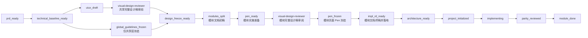

# flutter-workflow-orchestrator

`flutter-workflow-orchestrator` 是 Flutter 技能链里的总编排器。它不直接产出 PRD、Pencil、Flutter 代码或视觉稿，而是负责：

1. 判断项目和模块当前在哪个阶段。
2. 决定下一步该调用哪个 specialist skill。
3. 维护唯一流程记录文件 `docs/rd/00-workflow-record.md`。
4. 卡住所有未经确认的阶段切换和状态改写。

这次规则更新后，最重要的变化有四条：

1. `modules_split` 之前只冻结共享层，不冻结页面级设计。
2. 模块页面级设计、模块私有组件设计、`ui-ux.md` / `impl.md` 的实施级细化，都放到模块实施准备阶段完成，并且每次状态改写都要确认。
3. 每次完整设计稿产出后，都要先走 `visual-design-reviewer`，重点检查信息层级、关键任务引导、字体层级、对比度和 CTA 质量，再决定能不能冻结或继续下游。
4. 无论共享层还是模块层，只要评审不通过，都只允许按对应范围修改一次设计稿或效果图；这次修改完成后，本轮不再继续评审。

## 先看懂两层冻结

### 先看懂自动视觉审阅

这次新增的 `visual-design-reviewer` 不是新的大阶段，而是完整设计稿的自动审阅关卡。

这个审阅必须在 fresh subagent 中执行，只给子代理最小必要设计包，不能在主代理当前线程里内联审阅。这样做的目的，是避免主线程已经积累的大量上下文、历史判断和流程噪音污染设计判断。

它会在两个地方出现：

- 共享层视觉稿完整后，先审阅，再进入共享冻结审批
- 模块 page-level 设计稿完整后，先审阅，再进入 Pen 落地确认或后续 handoff

它关注的不是“好不好看”这么宽泛，而是五件直接影响商业质量的事：

- 信息层级是否清楚
- 关键任务引导是否明确
- 字体层级是否足够清楚
- 对比度是否足够可读、可扫、可点
- CTA 是否在 3 秒内足够明确

如果这几项里有明显问题，就不应该继续走冻结和交接。

而且现在冻结前评审有一条硬阈值：

- 审的是效果图、预览图、静态视觉稿或完整视觉结果
- `visual-design-reviewer` 评分必须 `>= 90`
- 只要 `< 90`，或者 review 仍要求改动，就不能冻结
- 只允许按对应范围返工一次
- 这次返工完成后，本轮流程停止，不再继续评审；若要继续，必须由用户显式重启新的设计轮次

### 共享层冻结

发生在 `modules_split` 之前，只冻结这些内容：

- 全局设计原则
- 主题值
- 共享 / 公共可复用组件
- 不允许下游擅改的公共视觉约束

这一层冻结的目标，是让模块拆分有稳定边界，而不是让页面已经可以直接开发。

### 模块实施冻结

发生在某个模块真正进入实施准备阶段之后。这里才会冻结：

- 页面级设计
- 模块私有组件设计
- 该模块的 page-level Pen
- 与该模块实现直接相关的 `ui-ux.md` / `impl.md` 终稿

也就是说：

- 共享层先冻结
- 模块先拆出来
- 真正要做哪个模块时，再把那个模块细化到可实施颗粒度
- 再产出并冻结该模块的 page-level Pen
- 然后才允许开始写代码

## 更新后的主流程



## 各阶段到底做什么

### `prd_ready`

只有 PRD、功能 brief 或粗 RD。

下一步一定先去 `flutter-prd-rd-writer`，补全全局技术基线。这里不能直接拆模块，也不能直接做页面。

### `technical_baseline_ready`

全局架构、包选型、后端协作方式、交付约束都已经明确，但共享设计方向还没定。

下一步通常去：

- `mobile-ui-design-coach`
- 或 `design-preview-to-global-guidelines`

### `uiux_draft`

这里是共享层 UI/UX 候选稿阶段。可以有视觉方向，可以有静态图，但还没有冻结。

只要共享层视觉稿已经完整，就会先自动调用 `visual-design-reviewer`，并且这一步必须由 fresh subagent 执行，重点检查信息层级、关键任务引导、字体层级、对比度和 CTA，再决定能不能进入冻结审批。

如果共享层效果图评分不到 `90`，或者审阅明确要求修改，就不能直接继续冻结，而是只允许回到共享层返工一次：

`mobile-ui-design-coach` -> 共享预览/效果图重出

这次共享返工完成后，本轮流程停止，不再自动或默认再次进入 `visual-design-reviewer`。如果还要继续，只能由用户显式重新发起新的共享设计轮次。

### `global_guidelines_frozen`

这里的冻结不再代表页面已经冻结。

它现在只表示这些东西已经冻结并确认：

- `global-design-guidelines.md`
- `light-theme-freeze.yaml`
- `dark-theme-freeze.yaml`
- 共享 / 公共组件约束

不要把这个阶段理解成“模块页面可以直接开做”。

### `design_freeze_ready`

这是共享层冻结审批前的准备态。

重点不是页面，而是确认：

- 共享设计原则是否足够稳定
- 共享组件是否能先作为全局输入
- 是否允许进入模块拆分

这里默认已经有一份最近的 `visual-design-reviewer` 结果，而且冻结前评分必须至少 `90`；没有的话，不应该直接进冻结审批。

### `modules_split`

这是这次规则变化最大的地方。

现在的 `modules_split` 只代表：

- 模块边界已经拆出来
- 每个模块都有自己的 `ui-ux.md` 和 `impl.md`
- 这些文档默认只是 `split_draft`

也就是说，拆分阶段产出的不是实施终稿，而是模块级初稿。

这些初稿要能表达：

- 模块目标
- 页面范围
- 核心路径
- 粗粒度状态矩阵
- 主要技术约束
- 后续要补细的开放问题

但它们还不应该被当成“已经可以直接落代码”的文档。

### `pen_ready`

这不是“已经出 Pen”。

这里表示的是：某个模块被选中，开始进入实施准备阶段。此时会做两件关键事：

1. 把这个模块的 `ui-ux.md` / `impl.md` 从 `split_draft` 细化到 `implementation_final`
2. 准备该模块的 page-level Pen 和模块私有组件设计输入

所以 `pen_ready` 更像“模块实施前精修阶段”。

当模块视觉稿已经完整时，也会先走一次 `visual-design-reviewer`，并且这一步也必须由 fresh subagent 执行，避免页面还没审清楚就直接把 Pen 当成可落地产物。

如果模块级效果图或完整视觉稿评分不到 `90`，同样不能进入冻结，但它走的是模块级返工一次，不是共享层返工闭环：

更新当前模块 `ui/ux` 文档 -> 在 Pen 中修改当前模块设计稿

这次模块返工完成后，本轮流程停止，不再自动或默认再次进入 `visual-design-reviewer`。如果还要继续，只能由用户显式重新发起新的模块设计轮次。

### `pen_frozen`

到这里，冻结的已经不是共享层，而是当前活动模块自己的设计源：

- 页面级 Pen
- 模块私有组件设计
- 模块实现 handoff 所需的设计源

这一步完成后，模块才算真正具备实施前的设计冻结条件。

### `impl_rd_ready`

这个阶段表示活动模块的 `ui-ux.md` / `impl.md` 已经：

- 从 `split_draft` 细化成 `implementation_final`
- 同步引用了当前模块的 Pen 设计源
- 在 Pen 已经落地后，状态可升级为 `landed`

只有到这一步，编排器才会认为“这个模块的文档输入已经可以支撑实现”。

### `architecture_ready`

把 Pen 设计源进一步转成 Flutter 侧真正可消费的结构：

- tokens
- assets
- components
- screen plan
- scaffold contract

### `project_initialized`

说明 `flutter-init` 已经生成：

- Flutter 工程骨架
- 项目根目录
- 项目内 `skills/flutter-dev/`

仍然要确认之后，才正式进入项目内实现技能。

### `implementing`

到这里才允许写代码。

而且前置条件必须同时满足：

- 模块已拆分
- 模块文档不再是 `split_draft`
- page-level Pen 已落地
- `impl_rd_ready` 已成立
- 工程已经初始化

### `parity_reviewed`

代码写完以后，不是直接 `module_done`，而是先做设计对齐检查。

### `module_done`

只有这些都完成，模块才算彻底完成：

- 共享层冻结已确认
- `ui-ux.md` 已落地
- `impl.md` 已落地
- Pen 已落地
- 代码已落地
- parity review 已通过

## workflow-record 里新增了什么

核心文件还是：

`docs/rd/00-workflow-record.md`

但现在除了 `current_stage`，还要跟踪模块产物成熟度。

### 元数据新增字段

顶部元数据块新增：

```yaml
pending_status_updates: <module.field=target list-or-none>
```

它用来保存“已经产出，但还没确认”的状态改写请求。

例如：

```yaml
pending_status_updates: home.uiux_status=implementation_final; home.impl_status=implementation_final
```

### 模块表新增字段

`module_status_table` 现在要能同时表达“文档路径”和“成熟度状态”，所以新增了这些列：

- `uiux_status`
- `impl_status`
- `visual_review`
- `review_followup_status`
- `pen_status`
- `code_status`
- `pending_status_updates`

其中 `review_followup_status` 用来表达失败评审后的那次唯一返工是否已经用掉：

- `not_needed`
- `revision_pending`
- `revision_completed_no_re_review`

## 这些状态怎么理解

### `uiux_status` 和 `impl_status`

- `not_started`
- `split_draft`
- `implementation_final`
- `landed`

含义分别是：

- `split_draft`：拆分阶段初稿
- `implementation_final`：已细化到可实施颗粒度，但还没通过对应 Pen 落地升级成已落地
- `landed`：对应 page-level Pen 已存在，文档也已同步引用并确认

### `pen_status`

- `not_started`
- `in_progress`
- `landed`

### `code_status`

- `not_started`
- `in_progress`
- `landed`

## 最关键的确认规则

这次更新后，确认门不仅管阶段切换，也管状态改写。

也就是说，下面这些都不能直接改：

- `current_stage`
- `uiux_status`
- `impl_status`
- `pen_status`
- `code_status`
- `init_status`

标准做法是：

1. 先保留当前已确认值不动
2. 把候选改动写进 `pending_next_stage` / `pending_next_skill` / `pending_status_updates`
3. `confirmation_status` 设为 `pending_confirmation`
4. 等用户明确确认
5. 确认后再真正改写当前状态

## 一条典型模块流转长什么样

以 `home` 模块为例：

1. 共享层设计冻结完成，允许模块拆分
2. `home.ui-ux.md` 和 `home.impl.md` 在 `modules_split` 阶段创建，状态是 `split_draft`
3. 当决定开始做 `home` 模块时，编排器把它推进到 `pen_ready`
4. `flutter-rd-module-splitter` 再次只细化 `home` 模块，把两个文档升级到 `implementation_final`
5. 这次升级先写入 `pending_status_updates`
6. 用户确认后，`home.uiux_status` / `home.impl_status` 才真正变成 `implementation_final`
7. 再调用 `design-preview-to-pen` 产出 `home` 的 page-level Pen
8. Pen 准备好后，再把 `pen_status=landed`，并把两个文档升级为 `landed`
9. 用户再次确认这些 landed 状态
10. 然后才能进入架构抽取、工程初始化和代码实现
11. 代码完成后，再把 `code_status=landed` 走一次确认
12. parity review 通过后，模块才进入 `module_done`

## 什么时候绝对不能开始写代码

只要有任意一条成立，就不能开始：

- 模块还没过 `modules_split`
- `uiux_status` 还是 `split_draft`
- `impl_status` 还是 `split_draft`
- page-level Pen 还没 `landed`
- `impl_rd_ready` 还没成立
- `flutter-init` 还没产出项目骨架
- 某个状态升级还在 `pending_confirmation`

## 这套规则解决了什么问题

旧的理解里，容易把“共享冻结”和“模块页面冻结”混在一起，导致：

- 模块拆分时文档就被误认为已经可以开发
- Pen 和页面级设计冻结过早发生
- workflow-record 只能看阶段，不能看成熟度
- 文档、Pen、代码谁已经真的落地，说不清楚

这次更新后，编排器能更明确地区分：

- 共享层是否已冻结
- 模块是否只是初稿
- 模块文档是否已经细化成终稿
- Pen 是否真的落地
- 代码是否真的落地
- 哪些状态还在等待确认

## 使用建议

如果你在看一个项目现在该做什么，优先看：

1. `current_stage`
2. `confirmation_status`
3. `pending_status_updates`
4. 当前模块的 `uiux_status`
5. 当前模块的 `impl_status`
6. 当前模块的 `visual_review`
7. 当前模块的 `pen_status`
8. 当前模块的 `code_status`

如果你看到：

- `modules_split + split_draft`

表示只是拆分初稿，还远没到能直接写代码。

如果你看到：

- `pen_ready + implementation_final`

表示这个模块已经进入实施准备，正在变成可实施终稿。

如果你看到：

- `pen_frozen + landed`

表示该模块页面级设计源已经冻结并落地，可以继续往架构和实现推进。

如果你看到：

- `pending_confirmation`

表示无论产物看起来多完整，当前状态都还不能算正式生效。
